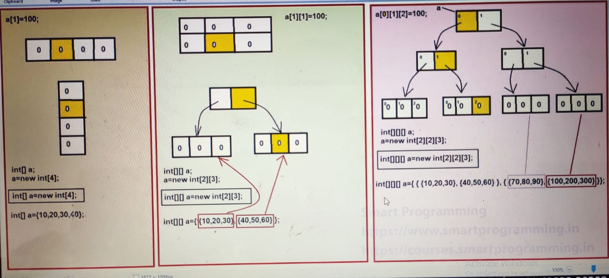

## Arrays: 

- Array is a collection of similar type of data (homogeneous data)
- Array elements are stored in contigeous memory locations
- Array can contain primitive or non-primitive elements 
- Array is index based data structure, first index position of array is 0.
- Array length starts from 1.

## Types of Arrays: 
- Single Dimentional Array.
    - 1D Array
- Multi-Dementional Array.
    - 2D Array
    - 3D Array
    - 4D Array
    - 5D, 6D, .... Array
    - Zic-Zac Array
- Anonymous Array.

## Single Dimensional Array (for example 1D Array) :

- In this type of Array, there is only one row or one column
    - Following points for each type of array:
    - 1-> Declaration
        - Array can be declared normally like simple variables but we have to provide square ([]) braces.
        - Example: 
            - int[] a;  //preferred way
            - int [] a;
            - int []a;
            - int a[];
            - String[] t;
            - We can also create class name array. 
        - When we declare an array, we don't need to provide the size of array. 
            - Example:
                - int[5] a; ❌
        - int[] a, b; // a and b both are Integer type array. ✔
        - int []a, b; //a and b both are Integer type array. ✔
        - int a[], b; // a is array but b is simple Integer variable. ✔
        - int a, b[]; // a is normal variable and b is array.
        - int a, []b; // a is Integer type array but b is not a array and when we compile then it throw error.
        - int a[], b[]; // a and b both are array.
        - int []a, b[]; // a and b both are array.
        
    - 2-> Creation
        - When we create an array by using new keyword, we have to provide the size of an array.
        - When we create an array by using new keyword, all the index position will be initialized by its default value that is 0.
        - When we create String type array by using new keyword , all the index position will be initilized by its default value that is NULL.
        - We can declare and create an array within single line.
        - int[] a; // declaration
        - a = new int[5]; // Creation
        - int[] a = new int[5]; ✔

        - int[] a = new int[]; ❌ compilation error because we should declare dimension of an array.
        - int[] a = new [5]int; ❌compilation error // we cannot write like this.
        - int[] a = new int[0]; // It will successfully compile and run the program.
        - int[] a = new int[-5]; // It will successfully compile but when will run the code it will throw RUN EXCEPTION (Negative size exception).

    - 3-> Initialization
        - If we don't initialize any proper index position value, then it will compile and run successfully.
        - int[] a = new int[5];
          a[5] = 10; // It will compiled successfully but will throw runtime exception saying ArrayIndexOutOfBoundsException
        - a[-1] = 10; // It will compile successfully but will provide runtime exception saying ArrayIndexOutOfBoundsException.
        
        - int[] a = {10, 20, 30};

    - 4-> Retrieve

        - int[] a = {10, 20, 30};
        for (int i=0; i<=2; i++) {
            System.out.println(a[i]);
        }

    ## Points to remember:
    - Array are Objects in java
    - Arrays are stored in "HEAP Area" 
    - Difference between declaring, creating and initializing an array with and without  using new keyword.
        - When we create an array without using new keyword then default value will not be initialized in the array, all the values will be initlized automatically in the array.

## Multi-Dimension Array (Array of an Array).
- If an array has multiple row and multiple columns then it is known as multi-dimensional array.
- Types of Multi-Dimensional array:

    - 2D Array (Matrix array or Jagged array)
        - Diagram representation
        - Following points for 2D Array
            - Declaration
                - For declaring 2D array, we have to use double square braces
                - int[][] a; // Prefered way
                  int [][]a;
                  int[][]a;
                  int [][] a;
                  int []a[];
                - Cases for Declaration :
                    - int []a, b; // a is 2D array; b is 2D array;
                    - int a[][], b; // a is 2D array, b is simple Integer variable;
                    - int []a[], b; // a is 2D array; And b is 1D array;
                    - int []a[], b[]; // Both are 2D array
                    - int [][]a, b[]; // a is 2D array, But b is 3D array
                    - int [][]a, []b; // compile time error

            - Creation
                - When we create 2D array, we have to provide the size of an array.
                - a = new int[2][3]; // there are 2 rows and 3 columns.
                - Cases for creation:
                    - a = new[2][3]; // correct
                    - a = new int[][] // compile time error (array dimension missing)
                    - a = new int[2][]; // correct (Jagged array)
                    - a = new int [][3]; // compile time error
                - We can declare and create 2D array in a single line.
                - Example: 
                    - int [][] a = new int[2][3]; //correct
                    - int[][] a = new int[2][]; // correct
                    - int [][] a = new int[][]; // error
                    - int [][] a = new int[0][0]; // correct
                    - int [][] a = new int[-2][3]; // will be compile succeesfully and it throw run time error that is NegativeArraySizeException.
            - Initialization
                - int [][] a = {{10, 20, 30}, {40, 50, 60}};
            - Retrieve
    - 3D Array (Matrix array or Jagged array)
        - Diagram Representation
        - How to declare, create and initialize 3D array:
            - Declaration: 
                - We can declare 3D array by using 3 square braces.
                - int[][][] a;
                  int[] [][]a;
                  int [][][]a;
                  int []a[][];
                  int a[][][];
                  a = new int[2][2][2];
                - Cases for Declaration:
                    - int[][][]a, b; //a & b are 3D array
                    - int [][]a[], b; // a is 3D array & b is 2D array;
                    - int [][]a[], b[]; // a & b is 3D array;
                    - int [][][]a, []b; // compile time error

            - Creation:
                - We can create an array by using new keyword. 
                - Cases for creations:
                    - a = new int[2][2][3]; ✔
                    - a = new int[2][2][]; ✔
                    - a = new int[2][][]; ✔
                    - a = new int[][][]; ❌(Compile time error)
                    - a = new int[2][][3]; ❌ (Compile time error)
            - Initialization:
                - a[0][1][2] = 100;
                - int[][][] a = {{{10, 20, 30}, {40, 50, 60}}, {{70, 80, 90}, {100, 200, 300}}}
                
                - System.out.println(a); // [[[I@659e0bfd = [[[ - 3D : I - Integer : @ : <hexadecimalvalue>
                - System.out.println(a[1]); // [[I@<hexadecimalvalue>
                - System.out.println(a[0][0]); // [I@<hexadecimalvalue>

                - System.out.println(a.length); // ✔ Output: 2
                - System.out.println(a[0].length); // ✔ Output: 2
                - System.out.println(a[0][0].length); // ✔ Output: 3
                - System.out.prinln(a[0][0][0].length); ❌ error
                - System.out.println(a[0][2].length); ❌ error (ArrayIndexOutOfBounce) 
            
            - Retrieve:
                - We can retrieve the elements of 3D array by using 3 for loops
                - for (int i=0; i<a.length; i++) {
                    for (int j=0; j<a[i].length; j++) {
                        for (int k=0; k<a[i][j]; k++) {
                            System.out.println(a[i][j][k]);
                        }
                    }
                }
            

    - 4D, 5D, 6D... Array

##  Example: 
        - class TwoDArrat() {
            public static void main(String[] args) {
                //TwoDArray ob=new TwoDArray();
                //System.out.println(ob);
                // Output: <package_name>.TwoDArray@<Unique_Id>

                //int [] a = {10, 20, 30, 40};
                // System.out.println(a); 
                //[I@659e0bfd  => [ : Single dimensional array; I : Integer : <Unique_id>
                

                // int [][] a = {{10, 20, 30}, {40, 50, 60}};
                //System.out.println(a); 
                // Output: [[I@659e0bfd  => [[ : 2D array : Integer : <unique_id>
                //System.out.println(a[0]);
                //Output: [I@2a139a55 => [ : 1D array : @ : <unique_id-Hexa_decimal_value>

                //System.out.println(a[0][0]);
                //Output: 10;

                //System.out.println(a[0][0][0]); compilation error

                //System.out.println(a.length);  //Output: 2
                //System.out.println(a[0].length); // Output: 3
                //System.out.println(a[0][0].length); // error
            }
        }

## Multi-Dimensional Array:
- Multi-Dimensional array can be matrix array or jagged array.
- Matrix array - The array in which there is fixed number of rows & columns.
- Jagged array - The array in which number of columns can be changed.

    - Example:
        - class multiDimension {
            public static void main(String[] args) {
                // int [][] a = new int[3][];
                <!-- a[0] = new int[4];
                a[1] = new int[3];
                a[2] = new int[5];

                a[0][0] = 10; -->

                int [][] a = {{10, 20, 30, 40}, {50, 60, 70}, {80, 90, 100, 200, 300}};
                
                for (int i=0; i<a.length; i++) {
                    for (int j=0; j<a[i].length; j++) {
                        System.out.print(a[i][j] + " ");
                    }
                    System.out.println();
                }
            }
        }

## Note: (Way of initilazation)
- way1 - 
    - int [][] a = new int[2][3];
    a[0][0] = 10;
- way2 - 
    - int [][] a = {{10, 20, 30}, {40, 50, 60}};

- way3 - 
    - int [][] a = new int[][] {{10, 20, 30}, {40, 50, 60}};

## Anonymous Array:
- An array that does not have any name is known as Anonymous Array
- For Example:
    - new int[] {10, 20, 30, 40};
- Use : Anonymous arrays are created when we want to use them instantly or only for one time.
- Anonymous arrays are created in the method signature.
- Anonymous arrays are used as an argument in the method.
- It can be single dimensional or multi-dimensional array.
- Example:
    - class AnonymousArray {
        public static void main(String[] args) {
            int [] arr = {10, 20, 30};
            AnonymousArray.sum(new int[] {10, 20, 30});
        }

        static void sum (int[] a) {
            int sum=0;
            for (int i=0; i<a.length; i++) {
                sum += a[i];
            }
            System.out.println("Sum of array is : " +sum);
        }
    }

## Different way of printing array elements
- way 1: for loop
    - int a[] = {10, 20, 30}; 
      // forward direction
      for (int i=0; i<a.length; i++) {
        System.out.println(a[i]);
      }

      // backward direction
      for (int i = a.length-1; i>=0; i--) {
        System.out.println(a[i]);
      }

- way 2: while loop
    - int a[] = {10, 20, 30};
      int j=0;
      while(j<a.length) {
        System.out.println(a[i]);
        j++;
      }

- way 3: for each loop
    - int a[] = {10, 20, 30};
      for (int k : a) {
        System.out.println(k);
      }

    - String str = {"Ajeet", "Ritesh", "Shubham", "sunny"};
      for (String s : str) {
        System.out.println(s);
      }

## Limitations of for-each loop:
- It does not track the index position of an array.
- It only iterates the elements in forward direction.

### Sorting:
- Bubble sort:
- Selection sort:
- Insertion sort:
- Merge sort:
- Quick sort:
- Heap sort: